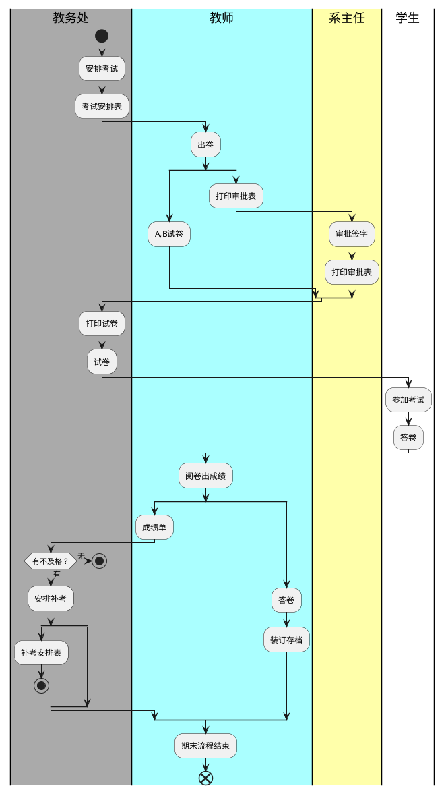
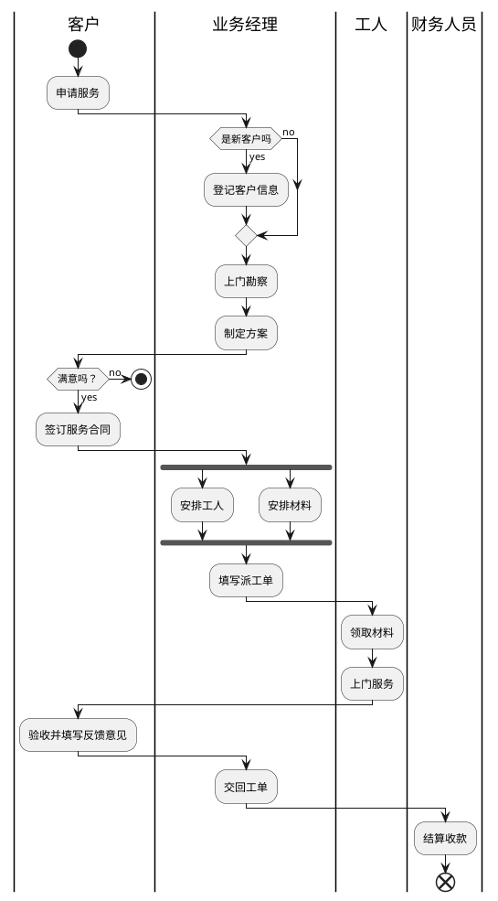

### 实验一：业务流程建模 
- 期末考试流程图源码 

```puml
@startuml
|#aaa|教务处|
start
:安排考试;
:考试安排表;
|#aff|教师|
:出卷;
split
    :A,B试卷;
split again
    :打印审批表;
|#ffa|系主任|
    :审批签字;
    :打印审批表;
|教务处|
end split

    :打印试卷;
    :试卷;
|学生|
    :参加考试;
    :答卷;
|教师|
    :阅卷出成绩;
split
    :成绩单;
|教务处|
    if(有不及格？)then(有)
    :安排补考;
    split
    :补考安排表;
    stop
    split again
    end split
    else(无)

    stop
    endif

split again
|教师|
    :答卷;
    :装订存档;
end split
    :期末流程结束;


end
@enduml
```
- 效果图片 

- 客户维护流程图源码

```puml
@startuml
|客户|
start
:申请服务;
|业务经理|
if(是新客户吗) then(yes)
    :登记客户信息;
    else (no)
    endif
    :上门勘察;
    :制定方案;
    |客户|
    if(满意吗？) then(yes)
    :签订服务合同;

    else(no)
        stop
    |业务经理|
    endif
    fork
    :安排工人;
    fork again
    :安排材料;
    end fork
    :填写派工单;
    |工人|
    :领取材料;
    :上门服务;
    |客户|
    :验收并填写反馈意见;
    |业务经理|
    :交回工单;
    |财务人员|
    :结算收款;
end
@enduml
```
- 效果图片 
