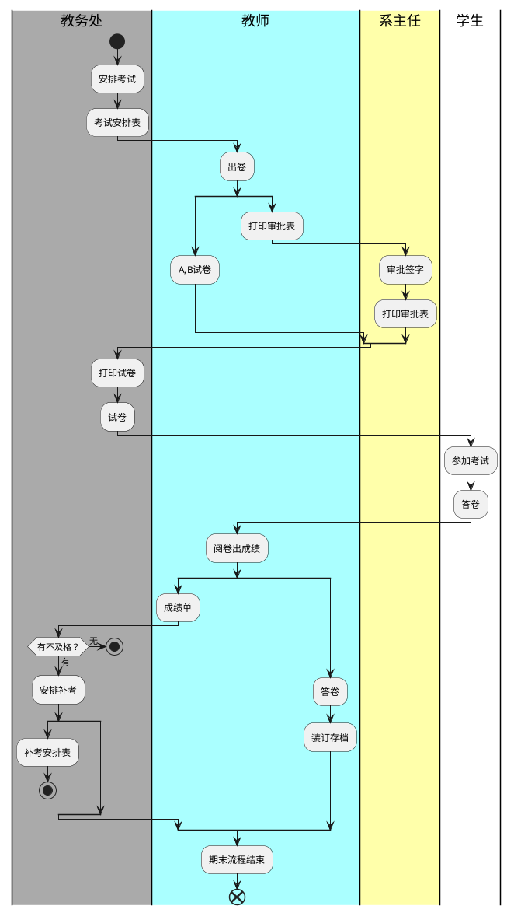
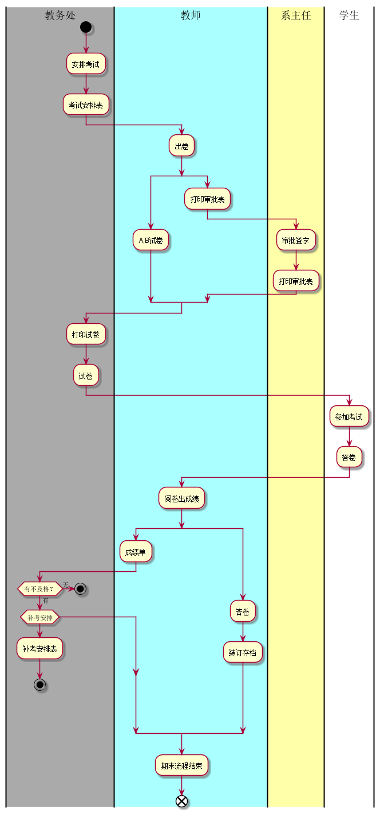
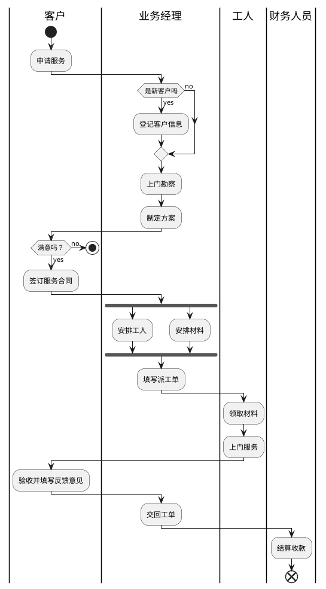
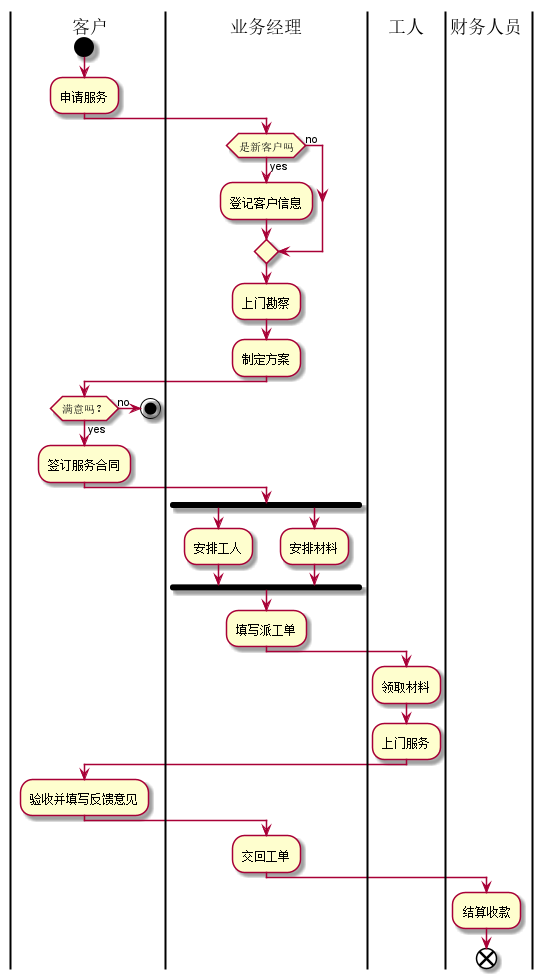

### 实验一：业务流程建模 
|学号|班级|姓名|照片|
|:-------:|:-------------: | :----------:|:---:|
|201610414102|软件(本)16-1|陈泽茂||
- 期末考试流程图源码 

- 效果图片 

- 流程说明  

        打印审批表与AB试卷同级执行，出成绩单之后有不及格的就安排补考，但是本学期流程结束。没有不及格的，不做任何处理
- 客户维护流程图源码

- 效果图片 
 

- 流程说明  
        客户申请如果是新客户则登记客户信息再做后续安排，若是老客户，直接开始后续流程。安排工人与安排材料并发执行