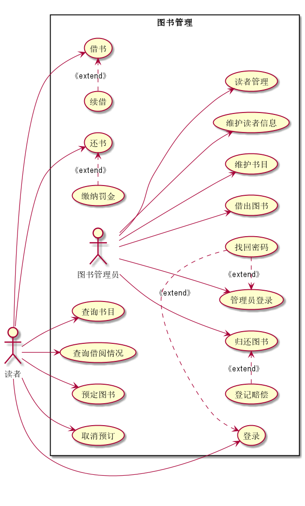

## 实验二：图书管理系统用例建模 
|学号|班级|姓名|照片|
|:-------:|:-------------: | :----------:|:---:|
|201610414102|软件(本)16-1|陈泽茂||
### 1.图书管理系统用例关系图
#### 1.1PlantUML源码如下：

#### 1.2用例图如下

### 2.参与者说明
#### 2.1图书馆理员
- 主要职责是：借出图书与归还图书的登记，定时维护书目，维护读者信息，对读者进行管理。
#### 2.2读者
- 主要职责：除了借书与还书外，还有可以查询书目，与书目借阅情况，预定图书，取消预订。
### 3.用例规约表
- [登录](login.md)
- [借出图书规约表](lend_book.md)
- [还书](return.md)
- [预定图书](order.md)
- [维护图书](maintain.md)

