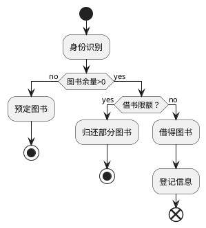
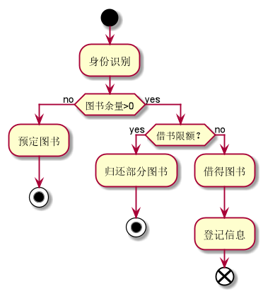

### 3.2借出图书用例
#### 3.2.1借出图书流程puml源码

#### 3.2.2借书流程效果图

#### 3.2.3借书规约表
|用例名称|借出图书|
|:------------:|:-----------------:|
|参与者|图书馆理员（主要参与者）、读者（次要参与者）|
|前置条件|图书管理员已被识别授权|
|后置条件|存储借书记录，更新库存数量，所借图书状态为借出|
|主事件流|1.图书馆里员将读者借书卡提供给系统   2.系统验证读者身份和借书条件   3.图书管理员将读者所借图书输入系统 4.系统记录借书信息 5.系统累加读者借书数量 6.重复3-5直到登记完成 7.打印借书清单，交易完成|
|备注|图书馆开架借阅，读者找到书后办理借书手续，因此借书不需要验证库存，而且每本书都是可识别的|
|备选事件流|a.非法读者：提示错误，拒绝输入 b.读者借书已达限额：提示失败情况及处理方式 c.读者有该书的预定记录1.删除记录。。。。。|
- [返回](README.md)