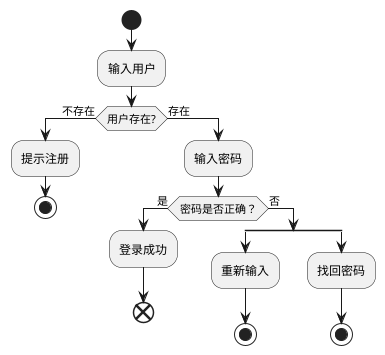
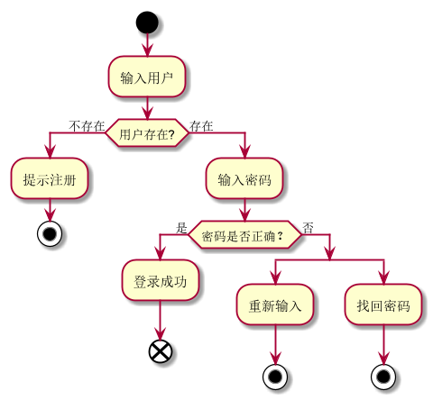

### 3.1用户登录用例|| [返回](README.md)
#### 3.1.1登录流程图Puml源码如下

#### 3.1.2登录流程效果图如下

#### 3.1.3登录规约表如下

|用例名称|用户登录|
|:------------:|:-----------------:|
|参与者|图书馆理员或读者|
|前置条件|管理员或读者有在系统中已经注册|
|后置条件|登录成功，记录登录信息（日志），进行登录后的业务操作|
|主事件流|1.用户输入用户名和密码   2.系统验证用户身份   3.系统验证用户密码  4.认证通过，进行业务操作|
|备注|用户登录输入用户名系统查询是否有该用户存在，验证密码后登录成功|
|备选事件流|a.用户不存在：提示未注册，用户不存在 b.密码错误：1.提示密码错误重新输入  2.提示找回密码 |