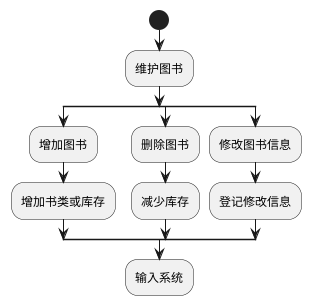
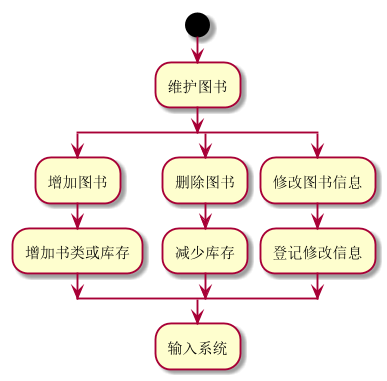

### 3.5维护书目|| [返回](README.md)
#### 3.5.1维护书目用例流程图puml源码

### 3.5.2维护书目用例流程图效果图

#### 3.5.3维护书目规约表
|用例名称|维护书目|
|:------------:|:-----------------:|
|参与者|图书馆理员|
|前置条件|图书管理员已被识别授权|
|后置条件|增加，减少图书，更新库存。更新图书信息|
|主事件流|1.图书馆购入新书，登记图书信息，存入 2.图书损毁退出书库，减少库存 3.图书信息等级有误，修改信息 4.1-3完成后打印清单|
|备注|维护图书，增加，减少，还有修改信息|
|备选事件流|1.书库无此类书：新增书类|
