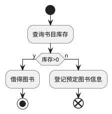
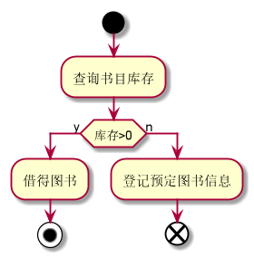

### 3.4预定图书|| [返回](README.md)
#### 3.4.1预定图书流程puml源码

#### 3.4.2预定图书流程效果图

#### 3.4.3预定图书规约表
|用例名称|预定图书|
|:------------:|:-----------------:|
|参与者|图书馆理员（次要参与者）、读者（主要参与者）|
|前置条件|图书管理员已被识别授权，图书库存为0|
|后置条件|登录预定书目信息，有人归还后提醒读者|
|主事件流|1.图书馆里员将读者借书卡提供给系统   2.查询图书信息   3.库存为0，登记预定信息|
|备注|图书馆开架借阅，读者查询书目后发现无余量，因此登记信息|
|备选事件流|a.非法读者：提示错误，拒绝输入 b.读者有该书的预定记录1.删除记录。。。。。|
