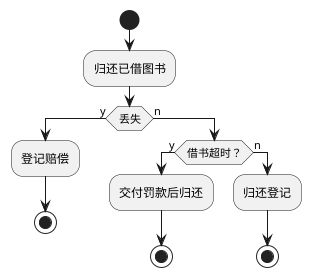
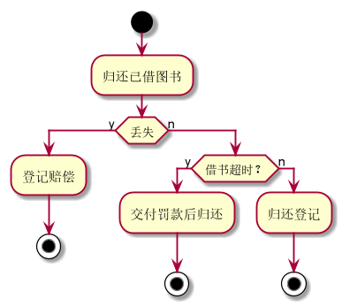

### 3.3还书用例
#### 3.3.1还书流程puml源码

#### 3.3.2效果图

#### 3.3.3还书规约表
|用例名称|还书|
|:------------:|:-----------------:|
|参与者|读者（主要参与者）、图书馆理员（次要参与者）|
|前置条件|读者已借书，读者与管理员被系统识别|
|后置条件|存储借书记录，更新库存数量，所还图书状态为已还|
|主事件流|1.图书馆里员将读者借书卡提供给系统   2.系统验证读者身份和借书条件   3.图书管理员将读者所还图书输入系统 4.系统记录还书信息 5.系统累加读者还书数量 6.重复3-5直到登记完成 7.打印还书清单，交易完成|
|备注|图书馆开架借阅，读者办理还书手续，因此还书不需要验证库存|
|备选事件流|a.非法读者：提示错误，拒绝输入 b.借书超时：缴纳罚款金额，归还成功  c.图书丢失：缴纳罚款，登记信息  d.续借：记录信息 
- [返回](README.md)