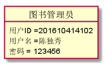

## 实验三：图书管理系统用例建模 
|学号|班级|姓名|照片|
|:-------:|:-------------: | :----------:|:---:|
|201610414102|软件(本)16-1|陈泽茂||
### 1.图书管理系统的类图
#### 1.1类图Puml源码如下

#### 1.2类图效果图

#### 1.3类图说明
- 通过该图可以看出读者，图书管理员，图书品种，借还记录和预定记录等领域对象  
还可以了解到还书超时罚款是通过借书日期可与还书日期来计算的，而用户与读者两种用户均继承于系统用户，但是各自有各自的特有方法。对于读者来说，借还记录是自己独有的所以是一对一关系，对于图书管理员来说借还记录是不同读者的记录，一个管理员会管理很多个读者所以是一对多关系。一个读者也可以多次查询与预定，所以读者与预定、查询也是一对多。
### 2. 图书管理系统的对象图
#### 2.1 类（图书管理员）的对象图
#### 源码如下

#### 对象图如下

#### 2.2 类（读者）的对象图
#### 源码如下

#### 对象图如下

#### 2.3 类（书库资源品种）的对象图
#### 源码如下

#### 对象图如下

#### 2.4 类（图书品种）的对象图
#### 源码如下

#### 对象图如下

#### 2.5 类（借还记录）的对象图
#### 源码如下

#### 对象图如下

#### 2.6 类（还书超时罚款）的对象图
#### 源码如下

#### 对象图如下

#### 2.7 类（预定记录）的对象图
#### 源码如下

#### 对象图如下

#### 2.8 类（查询书目）的对象图
#### 源码如下

#### 对象图如下

