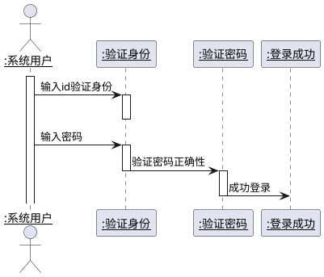
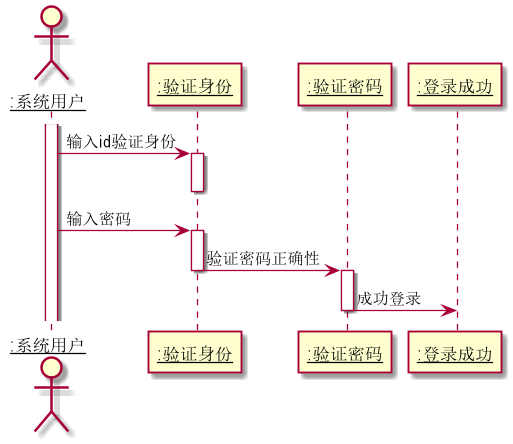
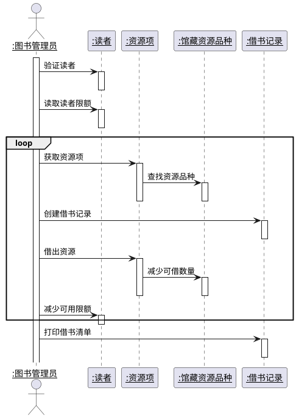
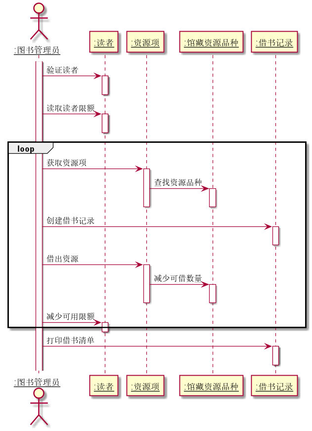
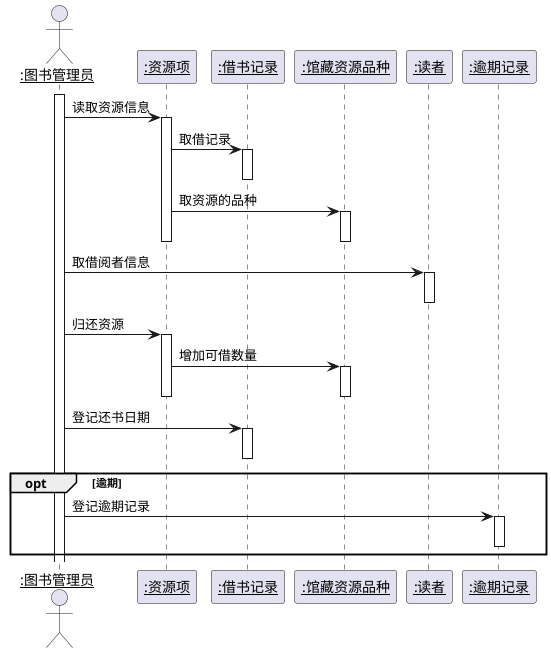
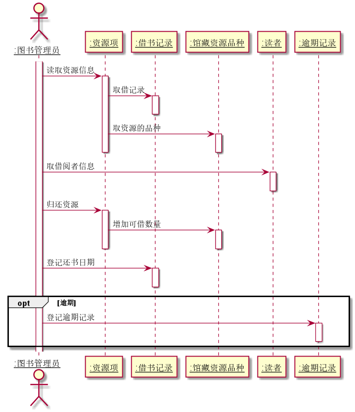
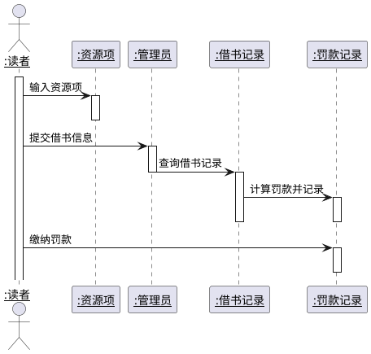
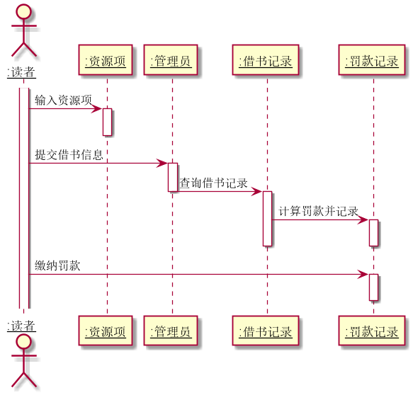
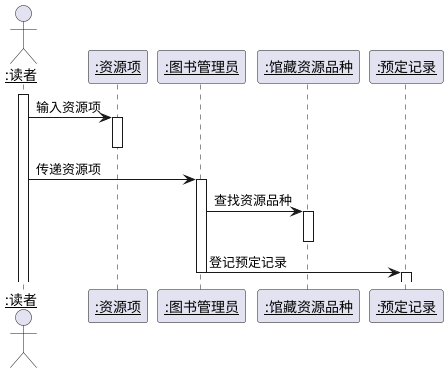
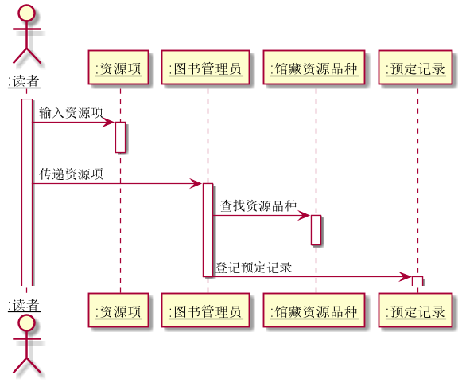

## 实验四：图书管理系统顺序图绘制
|学号|班级|姓名|照片|
|:-------:|:-------------: | :----------:|:---:|
|201610414102|软件(本)16-1|陈泽茂|

### 1.登录用例
#### 1.1登录用例PlantUMl源码

#### 1.2登录用例顺序效果图

#### 1.3登录用例顺序图说明
- 系统用户包括管理员和读者，用户登录时先输入ID验证身份与权限，系统判断用户是否存在，然后输入密码验证，最后登录成功
### 2.借书用例
#### 2.1借书用例PlantUMl源码

#### 2.2借书用例顺序效果图

#### 2.3借书用例顺序图说明
- 管理员验证读者是否符合借书条件，然后开始借书流程，借书流程正常完成后打印借书清单，记录借书信息。一次性可以借多本书，流程可以反复执行
### 3.还书用例
#### 3.1还书用例PlantUMl源码

#### 3.2还书用例顺序效果图

#### 3.3还书用例顺序图说明
- 管理员通过读者提供的信息查询借书记录，通过借书记录按资源项归还图书，增加此类图书库存，最后登记还书日期，若有逾期的情况，则执行逾期的顺序图流程
### 4.逾期罚款用例
#### 4.1逾期罚款PlantUMl源码

#### 4.2逾期罚款用例顺序效果图

#### 4.3逾期罚款用例顺序图说明
- 读者提交还书资源信息，管理员根据读者提供的信息查询借书记录，发现有逾期现象，开始计算逾期时间，与罚款项，最后读者缴纳罚款，管理员记录逾期记录。
### 5.预定图书用例
#### 5.1预定图书PlantUMl源码

#### 5.2预定图书用例顺序效果图

#### 5.3预定图书用例顺序图说明
- 读者输入预定资源项传递给管理员，管理员获取资源项后查询资源库匹配资源，确认可以预定再登记预定信息
