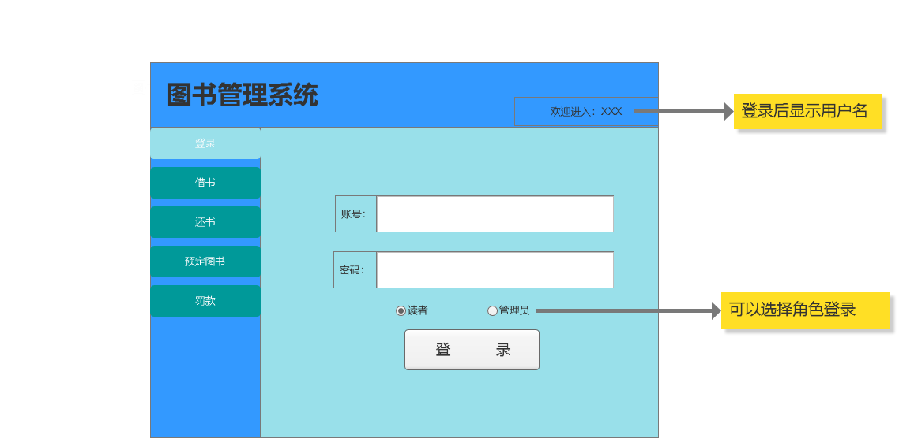

## 实验五：图书管理系统数据库设计与界面设计
|学号|班级|姓名|照片|
|:-------:|:-------------: | :----------:|:---:|
|201610414102|软件(本)16-1|陈泽茂|
### 1.数据库表设计
#### 1.1读者表
|字段|类型|主键，外键|可以为空值|默认值|约束|说明|
|-----------|---------|------------|-----------|----------|---------|----------|
|id|int(10)|主键|否|数据库自增|无|读者唯一标识|
|no|varchar(100)||否|借阅卡号|无|读者登陆系统账号|
|password|varchar(100)||否|123456|无|登陆密码|
|name|varchar(100)||是|无|无|读者姓名|
|limit|int(10)||否|20|无|借书限额|
 

#### 1.2管理员表
|字段|类型|主键，外键|可以为空值|默认值|约束|说明|
|-----------|---------|------------|-----------|----------|---------|----------|
|id|int(10)|主键|否|数据库自增|无|管理员唯一标识|
|no|varchar(100)||否|管理员卡号|无|管理员登陆系统账号|
|password|varchar(100)||否|123456|无|登陆密码|
|name|varchar(100)||是|无|无|管理员姓名|
 

#### 1.3图书表
|字段|类型|主键，外键|可以为空值|默认值|约束|说明|
|-----------|---------|------------|-----------|----------|---------|----------|
|id|int(10)|主键|否|数据库自增|无|唯一标识一本书|
|ISBN|varchar(100)||否|图书对应ISBN|无|国际标准号|
|name|varchar(100)||否|默认书名|无|图书展示名|
|count|int(10)||否|0|无|图书库存|
|price|double||否|0|无|图书价格|
|author|varchar(100)||否|无|无|图书作者|
|publish|varchar(100)||否|无|无|图书出版社|
 

#### 1.4借书记录表
|字段|类型|主键，外键|可以为空值|默认值|约束|说明|
|-----------|---------|------------|-----------|----------|---------|----------|
|id|int(10)|主键|否|数据库自增|无|唯一标识一条记录|
|Book_id|int(10)|外键|否|无|图书主键|标识一本图书|
|reader_id|int(10)|外键|否|无|读者主键|标识一个读者|
|manager_id|int(10)|外键|否|无|管理员主键|
|lend_date|datetime||否|无|无|图书借出日期|
 

#### 1.5还书记录表
|字段|类型|主键，外键|可以为空值|默认值|约束|说明|
|-----------|---------|------------|-----------|----------|---------|----------|
|id|int(10)|主键|否|数据库自增|无|唯一标识一条记录|
|Book_id|int(10)|外键|否|无|图书主键|标识一本图书|
|reader_id|int(10)|外键|否|无|读者主键|标识一个读者|
|manager_id|int(10)|外键|否|无|管理员主键|
|return_date|datetime||允许为空|无|无|图书归还日期|
 

#### 1.6预定图书记录表
|字段|类型|主键，外键|可以为空值|默认值|约束|说明|
|-----------|---------|------------|-----------|----------|---------|----------|
|id|int(10)|主键|否|数据库自增|无|唯一标识一条记录|
|Book_id|int(10)|外键|否|无|图书主键|标识一本图书|
|reader_id|int(10)|外键|否|无|读者主键|标识一个读者|
|manager_id|int(10)|外键|否|无|管理员主键|
|order_date|datetime||否|无|无|图书预定日期|
 

#### 1.7逾期罚款记录表
|字段|类型|主键，外键|可以为空值|默认值|约束|说明|
|-----------|---------|------------|-----------|----------|---------|----------|
|id|int(10)|主键|否|数据库自增|无|唯一标识记录|
|lent_id|int(10)|外键|否|无|借书记录主键|唯一标识一条借书记录|
|retur_id|int(10)|外键|否|无|还书记录主键|唯一标识一条还书记录|
|money|float||否|0.0|无|罚款金额|
 

### 2.界面设计
#### 2.1登录界面设计

- 用例图参见：[test2图书馆里类图登录用例](../test2/README.md)
- 类图参见：[test3图书管理系统类图，读者类，管理员类](../test3/README.md)
- 顺序图参见：[test4图书管理系统顺序图，登录顺序图](../test4/READMD.md)
- API接口如下：

1.返回登录信息

#### 2.2借书界面设计
#### 2.3还书界面设计
#### 2.4预定图书界面设计
#### 2.5逾期罚款界面设计