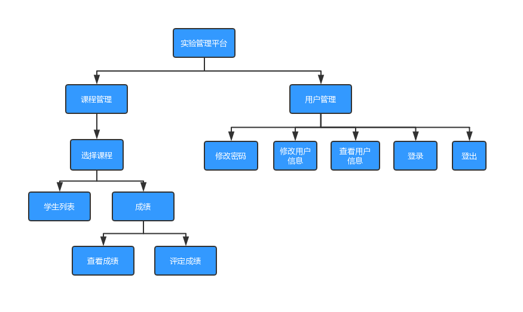

## 实验六：基于GitHub的实验管理平台的分析与设计
|学号|班级|姓名|照片|
|:-------:|:-------------: | :----------:|:---:|
|201610414102|软件(本)16-1|陈泽茂|
### 1.概述

- 基于GitHub的实验管理平台的作用是在线管理实验成绩的Web应用系统。学生和老师的实验内容均存放在GitHUB 页面上。
- 学生的功能主要有：一是设置自己的GitHub用户名，二是选择课程，三是查询自己的每一门课程的实验成绩。学生的GitHub用户名是公开的，但成绩不公开。
- 老师的功能主要有：一是选择课程，二是批改每个学生的成绩，三是查看每个学生每个课程的成绩。
- 老师和学生都能通过本系统的链接方便地跳转到学生的每个GitHUB实验目录，以便批改实验或者查看实验情况。
- 实验成绩按数字分数计算，每项实验的满分为100分，最低为0分。
- 系统自动计算每个学生的所有实验的平均分。
### 2.总体结构

### 3.用例图设计|[源码](实验管理平台.md)

