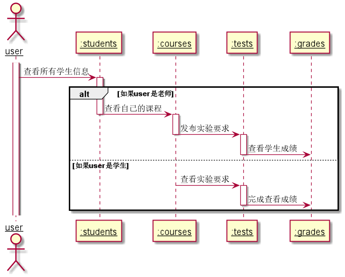

# “学生列表”用例 |[返回](../README.md)
## 1. 用例规约

|用例名称|学生列表|
|-------|:-------------|
|功能|显示所有学生信息|
|参与者|学生，老师,未注册用户|
|前置条件|学生老师均需要先登录系统|
|后置条件| 学生和老师可以开始使用实验系统完成教学任务|
|主事件流| 1.学生登录    2.老师登录    3.游客路过|
|备选事件流| 1.登录失败   2.网络错误|

## 2. 业务流程（顺序图） [源码](../uml/学生列表.puml)
 

## 3. 界面设计
- 界面参照: https://zemaochen.github.io/is_analysis_pages/test6/index.html
- API接口调用
    - 接口：[getStudents](../接口/学生列表.md) 

## 4. 算法描述
无    
## 5. 参照表
- [student](../md/数据库设计.md/#student)
- [courses](../md/数据库设计.md/#courses)
- [test](../md/数据库设计.md/#test)
- [grade](../md/数据库设计.md/#grade)
