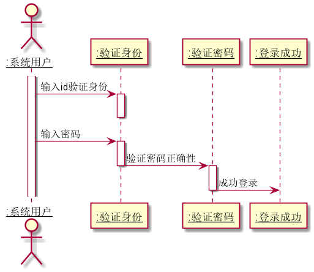

# “登录”用例 [返回](../README.md)
## 1. 用例规约

|用例名称|用户登录|
|:------------:|:-----------------:|
|参与者|老师或学生|
|前置条件|用户已在在系统中注册|
|后置条件|登录成功，记录登录信息（日志）|
|主事件流|1.用户输入用户名和密码<br>  2.系统验证用户身份<br>  3.系统验证用户密码<br> 4.认证通过|
|备注|用户登录输入用户名系统查询是否有该用户存在，验证密码后登录成功|
|备选事件流|a.用户不存在：提示id输入错误<br>b.密码错误：1.提示密码错误重新输入<br>|


## 2. 业务流程（顺序图） [源码](../uml/登录.puml)
 

    
## 3. 界面设计
- 界面参照: https://zemaochen.github.io/is_analysis_pages/test6/login.html

- API接口调用
- <p>登录</p>
- 功能：用于用户的登录
- 请求地址：http://[yourname]/api/login
- 请求方法：POST
- 请求参数：

|参数名称|必填|说明|
|------|---|---|
|user_id|是|用户ID|
|password|是|密码|
|method|是|固定为"POST"|
- 返回示例：
```json
{
    "data":
    {
       "info":"返回信息",
       "user":                                    
        {
              "user_id":"1",                        
              "name":"小李",              
              "last_login_time":"1438329358"                        
        }                           
     },
    "code":200
}
```
- 返回参数说明：

|参数名称|说明|
|---|---|
|data|返回参数数据主体|
|code|返回码|
    
## 4. 算法描述
    无
    
## 5. 参照表

- [user](../md/数据库设计.md/#user)

