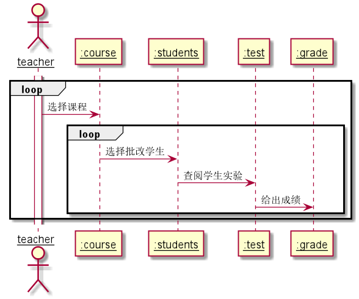

# “评定成绩”用例 [返回](../README.md)
## 1. 用例规约

|用例名称|评定成绩|
|-------|:-------------|
|功能|老师评定一个学生的实验成绩|
|参与者|系统中已注册的并且有选课的老师|
|前置条件|1.老师先登录，并且实验要求已经发布，学生已经提交 2.显示实验评分项，及评语|
|后置条件| 1.成绩评定完成后保存到课程成绩中， 2.系统通过每一次实验的成绩统计出平均成绩显示出来|
|主事件流| 1. 查看已有的成绩   2. 根据得分项给出得分和评语    3. 提交    4. 系统存储实验成绩和评语  5. 系统自动计算平均成绩|
|备选事件流|1.每一个得分项的成绩必须合法，可以为空，但不能超界  &nbsp;&nbsp; 1.提示用户重新输入成绩分数|

## 2. 业务流程（顺序图） [源码](../uml/评定成绩.puml)
 

    
## 3. 界面设计
- 界面参照: https://zemaochen.github.io/is_analysis_pages/test6/grade.html

- API接口调用

    - 接口1：[getStudents](../接口/学生列表.md)
        
        用于获取学生列表，便于选择学生，评定成绩
    - 接口2：[setOneStudentResults](../接口/setOneStudentResults.md)
        用于给出成绩
    
## 4. 算法描述
    无
    
## 5. 参照表

- [student](../md/数据库设计.md/#student)
- [grade](../md/数据库设计.md/#grade)
- [test](../md/数据库设计.md/#test)
- [course](../md/数据库设计.md/#course)

