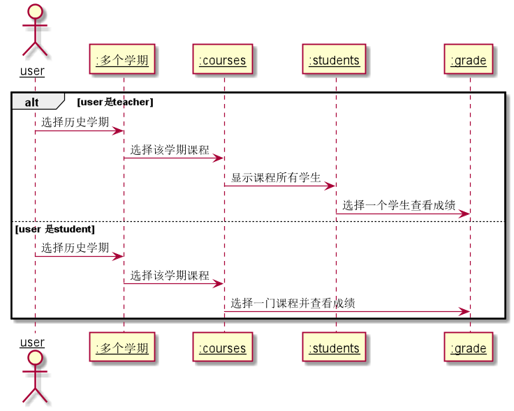

# “选择学期”用例 [返回](../README.md)
## 1. 用例规约

|用例名称|选择学期|
|-------|:-------------|
|功能|选择学期，查询历史成绩|
|参与者|学生，老师|
|前置条件|1.老师学生先登录 2.不止一个学期|
|后置条件|显示多个学期供用户选择|
|主事件流|1.选择一个学期|
|备选事件流|只有一个学期，没有选择|

## 2. 业务流程（顺序图） [源码](../uml/学期选择.puml)

    
## 3. 界面设计
- 界面参照: https://zemaochen.github.io/is_analysis_pages/test6/course.html
- API接口调用

    - 接口：[getSemester](../接口/getSemester.md)
        - 用于获取学生的所有学期信息
## 4. 算法描述
    无
## 5. 参照表

- [student](../md/数据库设计.md/#student)
- [teacher](../md/数据库设计.md/#teacher)
- [courses](../md/数据库设计.md/#courses)

