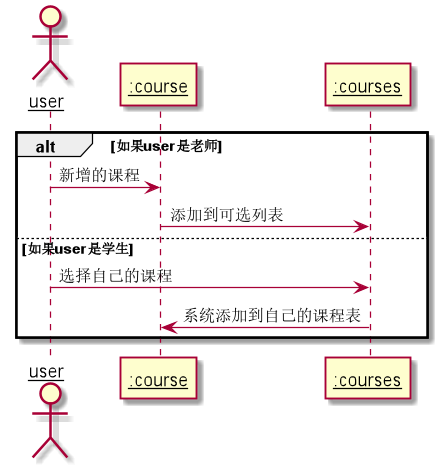

# “选择课程”用例 [返回](../README.md)
## 1. 用例规约

|用例名称|选择课程|
|-------|:-------------|
|功能|选课|
|参与者|学生，老师|
|前置条件|1.老师学生先登录 |
|后置条件|选择课程后学生拥有该课程，老师管理该课程|
|主事件流|老师先选择课程，学生后选择课程|
|备选事件流||

## 2. 业务流程（顺序图） [源码](../uml/选择课程.puml)

    
## 3. 界面设计
- 界面参照: https://zemaochen.github.io/is_analysis_pages/test6/course.html
- API接口调用

    - 接口1：[getSemester](../接口/getSemester.md)
        - 获取学期信息
        
## 4. 算法描述
    无
## 5. 参照表
- [user](../md/数据库设计.md/#user)
- [student](../md/数据库设计.md/#student)
- [teacher](../md/数据库设计.md/#teacher)
- [courses](../md/数据库设计.md/#courses)

